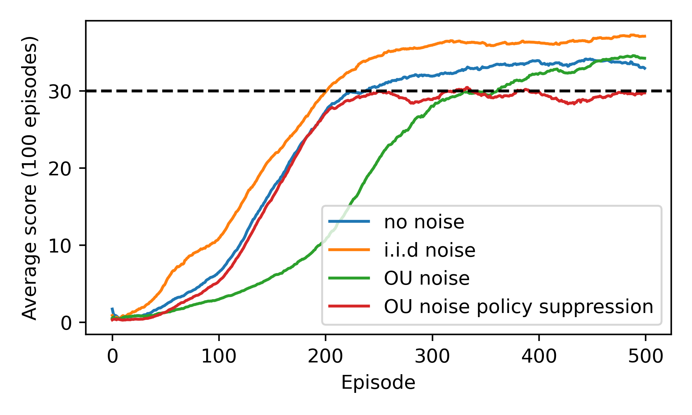

# Udacity DRLND

## [Report](./Report.md)

## P2 Continuous Control
Read about the project / environment [here](./UdacityP2ContinuousControl.md).

## Project Details
The learning task concerns manipulation of a simulated actuated mechanical limb,
by application of torque to its joints. The task of the agent is to keep the
end of the limb, the 'gripper', in the target area at all times. The target area
in in motion. The action space has 4 continuous dimensions, which represent the
torques applied to the joints. The representation of the environment presented
to the agent is a 33-dimensional vector.

The agent receives a positive reward at each time step where the gripper is in 
the target area. The environment is considered to be solved when the agent 
receives a cumulative average reward of > +30 over 100 consecutive episodes. Further details of the environment and its representation, as perceived by an agent, are given in the [report](./Report.md).

## Getting Started
1. Python Environment

The `setup_env.sh` script can be used to create and configure an environment with all the required dependencies to run the included code. The script assumes `conda` is available. The script requires 1 argument, which is the name that will be given to the created conda environment. E.g. `./setup_env.sh drlnd` will create a conda environment named 'drlnd' in which all the included code and programs should run. Alternatively, 
a `Dockerfile` is included, along with some pre-baked scripts that can run/train
the agent in a `docker` container.

2. Commons Code

The project depends on some commons code which is shared between this project and
another project forming part of the nanodegree. The code is included in this
repository as a submodule. You can simply fetch the `master` branch of the submodule
and install the package with pip, or run:

`pip install git+https://github.com/kyle-jarvis/drlnd-common.git@master#egg=drlnd-common`

## Instructions
The `continuous_control.py` file exposes a CLI build with `click`. The following
commands are available:

```
python ./continuous_control.py --help
Usage: continuous_control.py [OPTIONS] COMMAND [ARGS]...

Options:
  --help  Show this message and exit.

Commands:
  run    Initialise an agent using pre-trained networks and observe the...
  train  Train an agent in the 'one_agent' environment using DDPG.
```

### Training an agent

```
python ./continuous_control.py train --help
Usage: continuous_control.py train [OPTIONS]

  Train an agent in the 'one_agent' environment using DDPG.

Options:
  --n-episodes INTEGER  Number of episodes to train for
  --note TEXT           Note to record to .txt file when results are saved.
  --help                Show this message and exit.
```

E.g.

`python continuous_control.py train --n-episodes 500`

### Running a trained agent

```
python ./continuous_control.py run --help
Usage: continuous_control.py run [OPTIONS]

  Initialise an agent using pre-trained network weights and observe the
  agent's interaction with the environment.

Options:
  --weights-path TEXT   Path to the directory containing the trained weights
                        of the agent's network. Can be none, in which case the
                        pre-trained weights in resources are used.

  --n-episodes INTEGER  Number of episodes to train an agent for.
  --help                Show this message and exit.
```

E.g. Run a trained agent (included weights in resources) for 5 agents.

`python continuous_control.py run --n-episodes 5`

## Results

Some examples of the observed training schedules, under different exploration policies (governed by the form of the noise distribution exploratory actions are drawn from) are shown below.



Below is a GIF of the trained agent controlling a number of limbs simultaneously. Targets are visible as green spheres.

