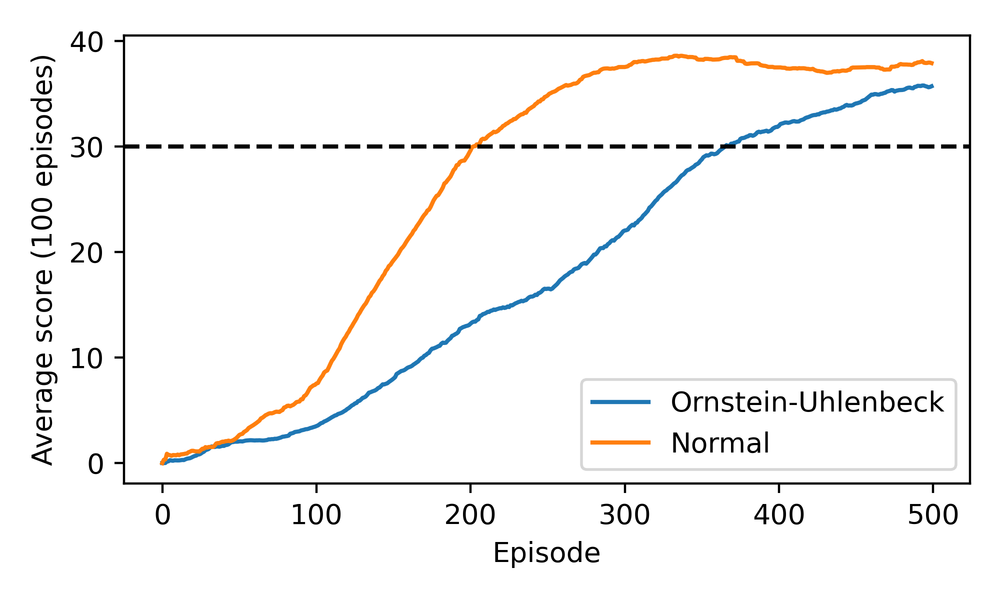

# Udacity DRLND
## P2 Continous Control

### Environment

Agents control an actuated limb by applying torque to its joints. Agents
receive a reward when the grabber, attached to the end of the limb, is in a
designated target zone. The target zone is in motion, and its trajectory is
randomised for each episode.

The environment is considered to have been resolved when the agent collects an average reward of at least +30 over 100 episodes.

The agent observes a 33-dimensional vector representation of the state, where
the components of the vector encode the current orientation and motion of both
the actuated limb and the target zone.

The action space is 4-dimensional and continuous.

## Learning Algorithm

The learning algorithm used to collect the below results is the Deep Deterministic
Policy Gradients algorithm described [here](https://arxiv.org/pdf/1509.02971.pdf).
Agents use a pair of networks to approximate the action-value function and to
encode a policy. Experiences are stored in a replay buffer, and mini-batches are sampled uniformly from this experience buffer at each update step.

For the results illustrated below, the architecture was as follows:

A. Actor
1. An input layer of (33) neurons.
2. A first hidden layer of 256 neurons.
3. A second hidden layer of 256 neurons.
4. An output layer of 4 neurons.

B. Critic
1. An input layer of (33) + (4) neurons.
2. A first hidden layer of 256 neurons.
3. A second hidden layer of 256 neurons.
4. An output layer of 1 neurons.

All layers are fully-connected, with ReLU activations applied to the neurons, except
for the output layers, where the Actor network has a tanh activation applied and
the critic has a simple linear activation.

Training proceeds in the usual way. During training, noise can be added to the agents
action selection. This can lead to more or less efficient exploration of the environment. 
In particular, as highlighted in [here](https://arxiv.org/pdf/1509.02971.pdf), 
a particularly useful form of noise for use in physical/mechanical simulations
with intertia is auto-correlated noise that can be obtained from a 
Uhlenbeck/Orstein process. For this report we have investigated how the noise 
distribution impacts the learning rate. 

### Hyperparameters

## Results

We have investigated how the learning process is affected by the particular
distribution of noise that is added to the agent's actions in order to define
the exploration policy. We have recorded how the agent learns when there is:

1. No noise added. (By this we mean that the action is generated only by the agent's policy network - which is randomly initialised - there is no additional noise distribution)
2. i.i.d noise added to each step in each episode. (Actions generated by the policy network are summed with an additional contribution sampled from a normal distribution. The width of the distribution is tapered linearly over 250 episodes.)

#TODO: GIF of agent.

## Future work

The code included in this repository can be extended in order to investigate
various aspects of reinforcement learning in this simple setting. 

1) It would be straightforward to investigate how varying the number of layers, 
and nodes in each layer, affects the capacity of the agent to achieve optimal performance.
2) The DQN architecture can be modified to accept raw pixel data, from the `VisualBanana_Linux`
environment, as its input, thereby presenting a more challenging learning task.
3) Prioritised experience replay and dueling DQN could be incorporated into the
existing project structure to investigate the benefits that these enhancements bring
to this particular task.